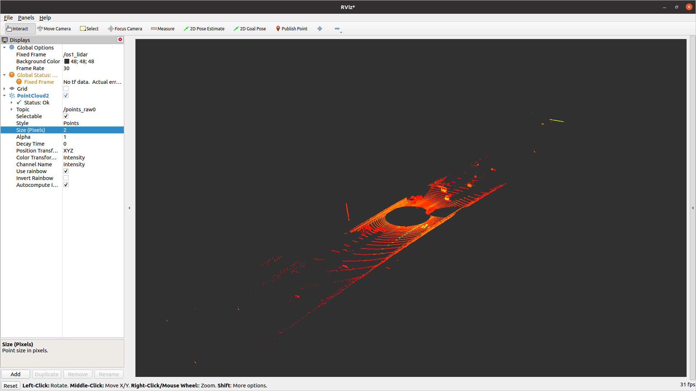
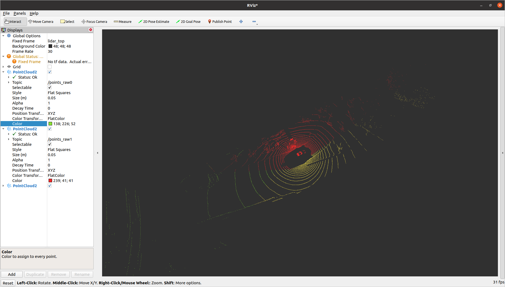

# BEVfusion
### Multiple Lidar preprocessor for BEVfusion  
2023 Summer Internship Program at SKYAUTONET.  

This project has based on [Adaptive-ROI](https://github.com/newintelligence4/Adaptive-ROI-for-Lidar.git).  


## Dataset
- Rosbags

## Requirements

- `diagnostic_updater`
- `point_cloud_msg_wrapper`

Install 2 library ubove using `sudo apt install ros-foxy-`


## Build
It has 3 different directories for each function.
1. lidar-preprocessing  
: the basic preprocessing module in 3 direction
2. multi-lidar  
: the package for concatenate the 3 topics
3. simple-topics  
: the simple package for publish the topics velocity

## Run
Before the RUN  
> Play the Rosbag
> * Remap to `/lidar_top`
>
> Run the 3 TF  
> * ```Shell ros2 run tf2_ros static_transform_publisher 0 0 0 0 0 0 /lidar_link /***_lidar_link```  
> * *** : `back`, `left`, `right`
</br>
Publish the Velocity

```Shell
 ros2 launch velocity_pubsub launch.py
```

Run the Lidar Node
```Shell
ros2 launch three_lidar launch.py
```
> input : `/lidar_top`  
> output: `/points_raw0`, `points_raw1`, `points_raw2`

Run the Concatenate Node
```Shell
ros2 launch concat preprocessing.launch.py
```


## Result
  
  


## Tools
- ROS2(foxy)
- C++
